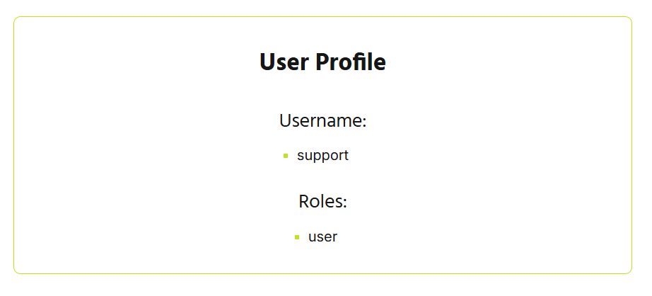
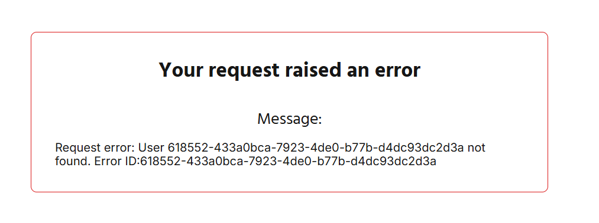
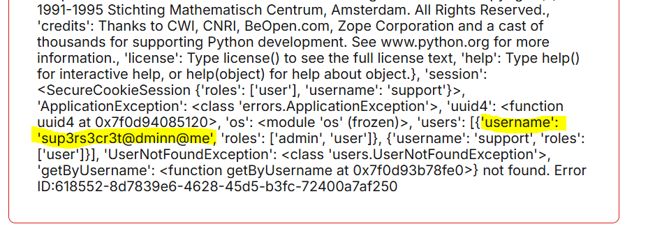
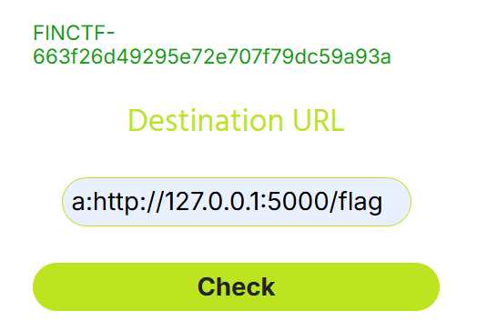

# Support: (Un)locked doors

## Description

> Un ancien collègue vous demande de l'aide pour tester le nouveau site web de sa compagnie qui vient d'être mis en ligne.
>
> Il demande votre aide pour identifier de potentielles faiblesses dans la logique de l'application. Il vous a donc partagé le code source de la solution.
>
> Celui-ci vous demande de tenter de récupérer les secrets qu'il a ajoutés dans le site. Le premier se trouve dans la page /user.html, lorsque connecté en tant que compte de support.

## Analyse


Lorsqu'on accède au site, on tombe sur une plateforme de tech support. Le site nous indique que la plateforme se concentre sur la sécurité des accès pour ses utilisateurs *(ominous foreshadowing)*.

On a également accès à tout le code source de l'application et on sait que le premier flag se trouve dans la page `/user.html`, lorsqu'on est connecté avec le compte de support.

Dans le code source fourni, on voit qu'il y a une fonction qui est exécutée à chaque requête pour valider si l'utilisateur a les permissions nécessaire pour accéder à la page.

```py
@app.before_request
def rbac_middleware():
    if request.path.startswith('/static/'):
        return

    page = utils.get_request_page(request)

    if page in rbac.keys():
        has_role = False

        for role in rbac[page]:
            if role in session["roles"]:
                has_role = True
                break

        if not has_role:
            return redirect("/login.html")
    else:
        return redirect("/404.html")
```

On va ensuite voir comment la fonction détermine à quelle page l'utilisateur tente d'accéder avec la fonction `get_request_page`. Cette fonction implémente un parser custom des uri pour obtenir le nom de la page :

```py
def get_request_page(request):
    url_split = request.url.split("/")

    i = len(url_split) - 1

    page = ""

    while(i >= 0):
        try:
            if (url_split[i].index('.html') > 0):
                split_parameter = url_split[i].split("?")
                page = split_parameter[0].lower()
                break
    [...]
```

Il split tous d'abord l'uri à tous les `/` puis valide si chaque partie de la chaine contient `.html`. Il retourne la première chaine qui match ce critère en partant de la fin.

Il est donc possible de faire retourner la page que l'on désire en utilisant cette fonction. Il suffit de passer un param qui contient un `/` et un `.html`. Ex:

`https://support.challenges.finctf.ettic.net/profile.html?param=/index.html` va retourner `index.html`.

Puisque le seul rôle qu'on a pour l'instant est `guest`, on peut truquer le serveur pour lui dire qu'on accède à une page à laquelle on a accès (ex.: `index.html`), alors qu'on accède réellement à une page qu'on aurait pas accès (ex.: `profile.html`). Cela nous permet d'accéder à des pages qui sont disponibles seulement pour le rôle `user`. 

Il reste juste à trouver ce qu'on peut exploiter dans ces pages...

Dans app.py, lorsqu'on navigue vers `profile.html` on accède à cette fonction :

```py
@app.route(PAGE_GET_USER, methods=["GET"])
def getUserProfile():
    if (request.args.get('user') == None):
        return redirect(PAGE_USER)

    result = users.getByUsername(request.args.get('user'))
    return render_template('profile.html', username=result["username"], roles=result["roles"])
```

Dans la fonction `getByUsername`, on voit qu'il met à jour la session avec l'utilisateur trouvé lors de la recherche : `session.update(user_entry)`. Il faut tout simplement lui passer un username existant dans la bd afin de se connecter en tant que cet utilisateur.  

## Exploit

Il suffit donc de naviguer vers cet url : 

`https://support.challenges.finctf.ettic.net/profile.html?user=support&param=/index.html`

On truque le serveur en disant qu'on va accéder à `index.html` puisqu'on a les permissions requises pour accéder à cette page, mais on accède réellement à `profile.html`, ce qui met à jour notre session avec l'utilisateur `support` et le role `user`.



*hacker voice* : I'm in

Voila, on est maintenant connecté en tant que support, il suffit de naviguer vers la page user.html pour faire afficher le flag : 

`FINCTF-5533741143cead9d26622648bb366e`

# Support: Not so secret

## Description

> Après avoir avisé votre ancien collègue de votre trouvaille, il est soulagé d'avoir mis en place une mesure pour protéger le nom d'utilisateur du compte administrateur.
>
> La page /user.html de ce compte contient le deuxième secret. Est-il vraiment aussi bien protégé qu'il le croit ?

## Analyse

Il faut maintenant se connecter en temps qu'administrateur pour pouvoir accéder à la page `/superadmin.html`. La solution utilisée précédemment n'est pas possible pour l'instant puisqu'on ne connait pas le nom d'utilisateur de l'admin.

En fouillant un peu dans le code fourni, on trouve ce bout de code :

```py
class ApplicationException(Exception):
    def __init__(self,message):
        super().__init__("Request error: " + message + ".\nError ID:{error.id}")
```

On voit que dans la gestion d'erreur, il concatène simplement le message à la chaine alors que c'est une chaine formatée. 

Il reste juste à trouver une façon de lancer une erreur avec notre propre message d'erreur.

En fouillant un peu plus, dans `users.py`, on voit qu'il lance une exception avec le nom d'utilisateur si l'utilisateur n'est pas trouvé.

```py
if user_entry is None:
    raise UserNotFoundException(username)
```

On peut donc utiliser le formattage de chaine de python pour faire afficher l'attribut id de l'erreur par exemple :

`https://support.challenges.finctf.ettic.net/profile.html?user={error.id}`

Ce qui nous affiche :



On voit qu'il nous affiche l'id du message d'erreur comme si s'agissait le nom de l'utilisateur. En poussant cet faille, on pourrait surement utiliser la réflection pour faire afficher des informations intéressantes...

## Exploit

En utilisant la réflection de python, on peut donc faire afficher le dictionnaire des variables définies sur le serveur avec cette requête.

`https://support.challenges.finctf.ettic.net/profile.html?user={error.__init__.__globals__}`



Parmi les variables, on retrouve `users` qui contient :

`'users': [{'username': 'sup3rs3cr3t@dminn@me', 'roles': ['admin', 'user']}`

On sait donc que le username de l'admin est `sup3rs3cr3t@dminn@me`

On peut utiliser le même tour que dans le challenge précédent pour mettre à jour sa session avec admin :

`https://support.challenges.finctf.ettic.net/profile.html?user=sup3rs3cr3t@dminn@me`

En naviguant vers `user.html` On trouve le flag : 

`FINCTF-3a2523b746add5ccb9b2acace14705`


# Support: Protected endpoint

## Description

> Fasciné par votre succès, votre ancien collègue vous indique que le dernier secret est accessible en appelant la route /flag de l'API exécutée sur le port local 5000 du serveur.
>
> Il se réjouit de ne pas encore avoir implémenté les fonctionnalités du portail d'administration permettant d'effectuer des requêtes à cette API, qui permet d'administrer les différents services internes de la compagnie.

## Analyse

En tant qu'admin, on a maintenant accès à la page `superadmin.html`, la page reçoit un POST avec un url 

```py
[...]
(scheme, host, path, query, fragment) = urllib.parse.urlsplit(url)

    if host == "127.0.0.1:4000":
        requestUrl = urllib.parse.urlunsplit(
            ('http', '127.0.0.1:4000', path, query, fragment))
    else:
        # Preventing calls to another host
        requestUrl = urllib.parse.urlunsplit(('', '', path, query, fragment))
    try:
        res = requests.get(requestUrl)
[...]
```

On a besoin de faire une requête vers la page `http://127.0.0.1:5000/flag`.

Il faut donc trouver une façon de tricher le `urllib.parse.urlsplit` pour qu'une fois qu'il le unsplit, notre url contienne seulement l'url du flag. Faut donc aller voir dans le code source de la lib `urllib`.


En explorant le code source de urllib, on trouve ce bout de code dans la fonction `_urlsplit` :

```py
[...]
i = url.find(':')
if i > 0 and url[0].isascii() and url[0].isalpha():
    for c in url[:i]:
        if c not in scheme_chars:
            break
    else:
        scheme, url = url[:i].lower(), url[i+1:]
if url[:2] == '//':
    netloc, url = _splitnetloc(url, 2)
[...]
```

Dans le code source, on voit que les `:` sont gérés indépendamment des `//`. 

Alors, si on met un `:` sans mettre le `//`, toute la partie de l'url suivant le `:` sera considéré comme url et le netloc restera vide.

## Exploit

On peut donc fabriquer un url comme celui-ci :

`a:http://127.0.0.1:5000/flag`

Lorsque l'url est splitté, le `a` sera considéré comme schéma, le netloc sera vide et le path va contenir `http://127.0.0.1:5000/flag`. Ensuite, l'url va être réassemblé par cette fonction :

`requestUrl = urllib.parse.urlunsplit(('', '', path, query, fragment))`

En analysant la méthode qui unsplit l'url, on peut voir que le `a` sera écrasé par une chaine vide, alors l'url réassemblé contiendra juste le path, soit `http://127.0.0.1:5000/flag`.



On obtient le flag :

`FINCTF-663f26d49295e72e707f79dc59a93a`